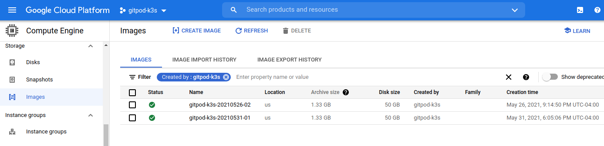

# gitpod-packer-gcp-image

Build a custom VM image in GCP using [packer.io](https://packer.io) for k3s

**Requirements:**
- gcloud CLI
- GCP account
- GCP Project with `Compute Engine` and `Service Networking` API enabled

```console
PROJECT_ID=$(gcloud config get-value project) \
ZONE=us-west1-a \
IMAGE_ID=gitpod-k3s-$(date +%Y%m%d)-01 \
./build
```


