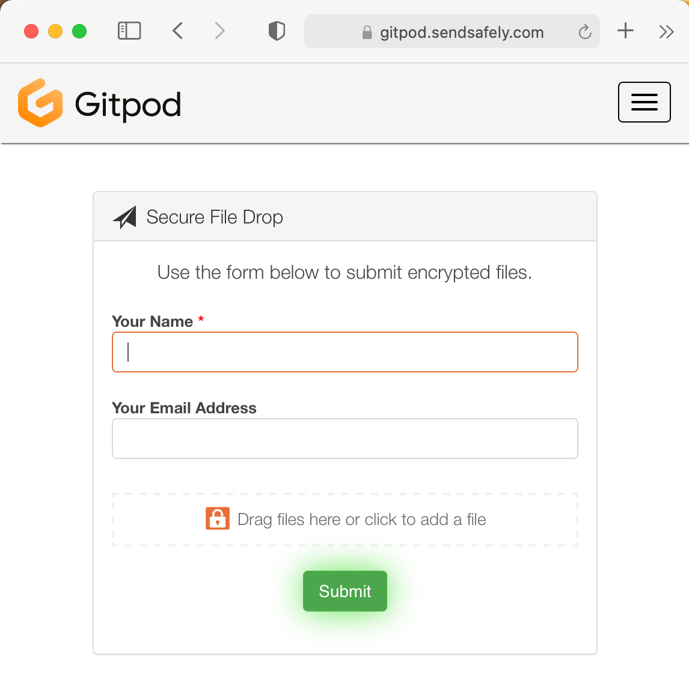
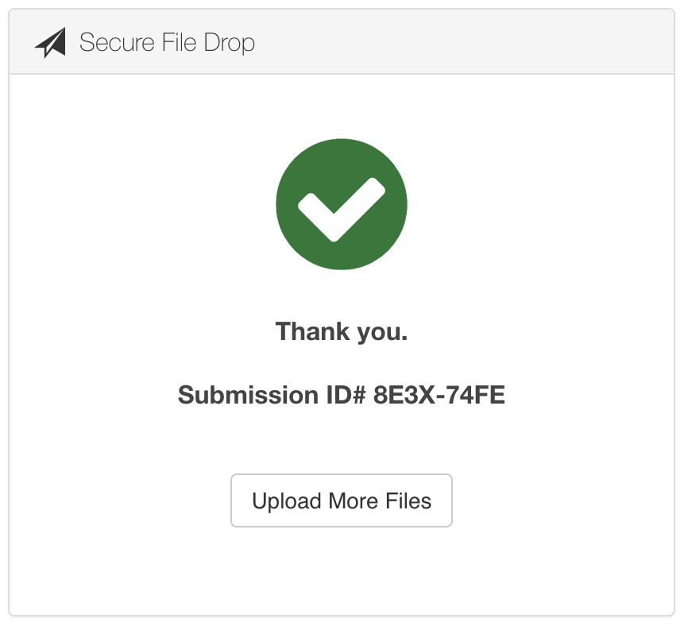

# Gitpod Self-Hosted Support Bundle

## Generating the support bundle

0. Familarise yourself with the [information that is collected](./support-bundle.yaml) and the [tool that consumes this configuration file](https://troubleshoot.sh/) and, if required, adjust what is collected.

1. Download the [Support Bundles Framework for Kubernetes Applications](https://github.com/replicatedhq/troubleshoot) tool from GitHub:

```bash
# Linux
curl https://github.com/replicatedhq/troubleshoot/releases/download/v0.13.7/support-bundle_linux_amd64.tar.gz --location --output support-bundle-tool.tar.gz

# macOS 
curl https://github.com/replicatedhq/troubleshoot/releases/download/v0.13.7/support-bundle_darwin_amd64.tar.gz --location --output support-bundle-tool.tar.gz

# Windows
curl https://github.com/replicatedhq/troubleshoot/releases/download/v0.13.7/support-bundle_windows_amd64.zip --location --output support-bundle-tool.zip
```

2. Extract the support bundle tool:

```bash
# Linux or macOS
tar -xvf support-bundle-tool.tar.gz

# Windows
Expand-Archive support-bundle-tool.zip
```

3. Here are the possible command line options for the tool:

```bash
./support-bundle --help
A support bundle is an archive of files, output, metrics and state
from a server that can be used to assist when troubleshooting a Kubernetes cluster.

Usage:
  support-bundle [url] [flags]
  support-bundle [command]

Available Commands:
  analyze     analyze a support bundle
  help        Help about any command
  version     Print the current version and exit

Flags:
      --as string                      Username to impersonate for the operation
      --as-group stringArray           Group to impersonate for the operation, this flag can be repeated to specify multiple groups.
      --cache-dir string               Default cache directory (default "/home/$USERNAME/.kube/cache")
      --certificate-authority string   Path to a cert file for the certificate authority
      --client-certificate string      Path to a client certificate file for TLS
      --client-key string              Path to a client key file for TLS
      --cluster string                 The name of the kubeconfig cluster to use
      --collect-without-permissions    always generate a support bundle, even if it some require additional permissions
      --context string                 The name of the kubeconfig context to use
  -h, --help                           help for support-bundle
      --insecure-skip-tls-verify       If true, the server's certificate will not be checked for validity. This will make your HTTPS connections insecure
      --interactive                    enable/disable interactive mode (default true)
      --kubeconfig string              Path to the kubeconfig file to use for CLI requests.
  -n, --namespace string               If present, the namespace scope for this CLI request
      --redact                         enable/disable default redactions (default true)
      --redactors strings              names of the additional redactors to use
      --request-timeout string         The length of time to wait before giving up on a single server request. Non-zero values should contain a corresponding time unit (e.g. 1s, 2m, 3h). A value of zero means don't timeout requests. (default "0")
  -s, --server string                  The address and port of the Kubernetes API server
      --since string                   force pod logs collectors to return logs newer than a relative duration like 5s, 2m, or 3h.
      --since-time string              force pod logs collectors to return logs after a specific date (RFC3339)
      --tls-server-name string         Server name to use for server certificate validation. If it is not provided, the hostname used to contact the server is used
      --token string                   Bearer token for authentication to the API server
      --user string                    The name of the kubeconfig user to use
```

4. By default the tool will retrieve information from the `default` kubernetes namespace from your default `kubeconfig` . If Gitpod Self-Hosted has been installed in a different namespace or you need to query a different cluster then append the following command arguments with the appropraite configuration:

```bash
      --kubeconfig string              Path to the kubeconfig file to use for CLI requests.
  -n, --namespace string               If present, the namespace scope for this CLI request
```

5. Generate the support bundle

```bash
# If you have internet connectivity
./support-bundle https://raw.githubusercontent.com/gitpod-io/support-bundle/main/support-bundle.yaml

# In an air-gapped environment download the YAML and run locally
./support-bundle ./support-bundle.yaml
```

6. Extract the support bundle and review the contents

```bash
# Linux or macOS
tar -xvf support-bundle-20*.tar.gz

# Windows
Expand-Archive support-bundle-20*.tar.gz
```


## 2. Reviewing the support bundle

The Gitpod Self-Hosted support bundle is generated by https://troubleshoot.sh/ which automatically redacts the following:

- AWS credential environment variables in JSON.
- HTTP/HTTPS/FTP connection strings that contain a username and password.
- Database connection strings containing a username and password, standard Postgres and MySQL connection string components, and 'database' environment variables in JSON.
- All IPv4 addresses.
- API token environment variables in JSON.
- Password environment variables in JSON.
- Username credential environment variables in JSON.

After the redaction phase it is still possible that the generated support bundle may contain sensitive information (everyone has a different defintion of what is sensitive) thus we recommend that you throughly review the generated tarball before uploading the bundle to Gitpod's end-to-end secure data exchange portal. 

If, upon review, you feel that there is data that should be redacted by default please start a discussion in a GitHub issue and/or send in a pull-request that [implements the selector and redactor](https://troubleshoot.sh/docs/redact/redactors/). 🧡


## 3. Uploading the support bundle

Information (messages and attachments) sent via the Gitpod secure data exchange portal are secured by end-to-end encryption, automatically expire and are not stored in email.

0. Visit the Gitpod Secure data exchange portal at  https://gitpod.sendsafely.com/dropzone/support 



1. Complete the verification of your email address navigation journey and the captcha.

2. Attach the support bundle.

3. Optionally, attach a message.

4. Press `Submit`.

5. Inform the Gitpod employee who instructed you to upload the support bundle that it has been uploaded and provide them with the `Submission ID#`.  

