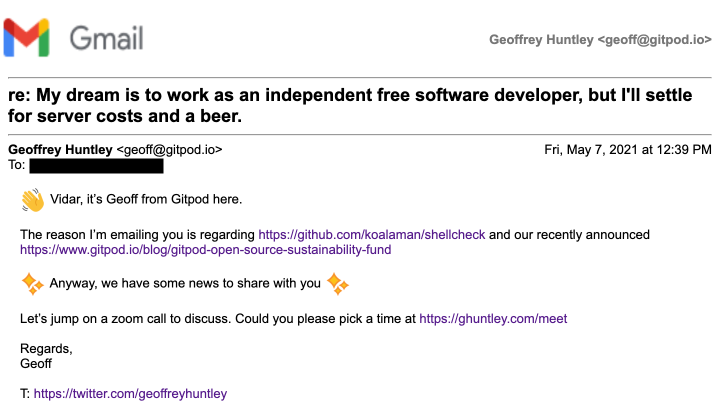
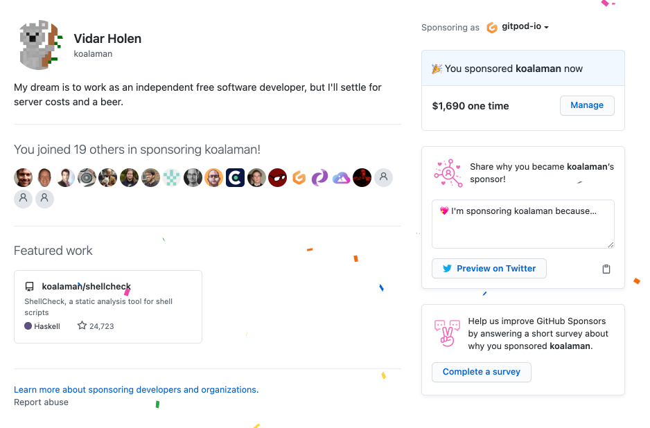
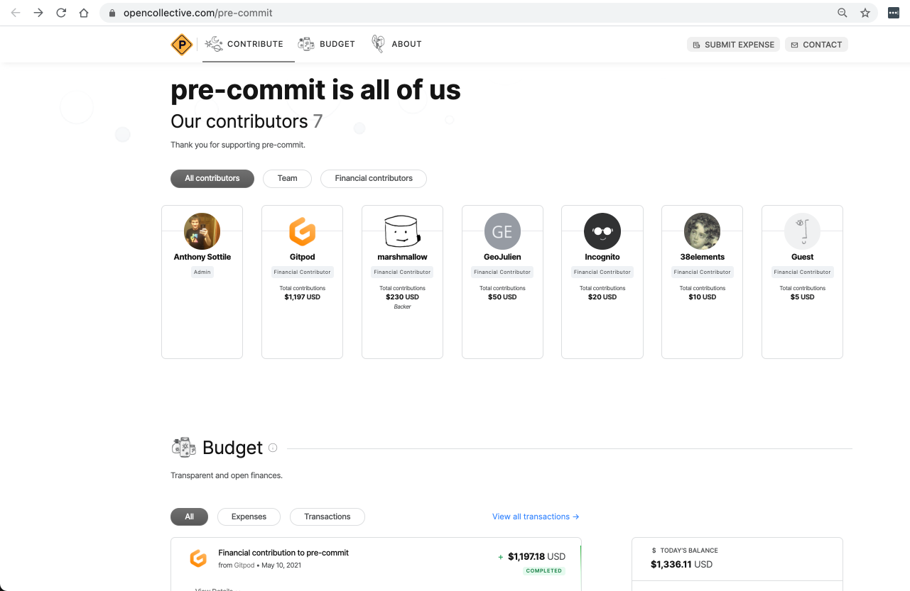

On April 28- 29 we hosted the [DevX Conference](http://www.devxconf.org), a space where creators could collaborate, listen, discuss and declutter dev workflows, toolchains and minds. To improve developer experience. We wanted to foster an ecosystem that sparks dialogue and establishes best practices and frameworks across the areas of coding, testing, building, deploying, collaborating on, and running software.

Speakers included [Jason Warner](https://twitter.com/jasoncwarner) (CTO Github), [Beyang Liu](https://twitter.com/beyang) (CTO Sourcegraph), [Josh Long](https://twitter.com/starbuxman) (Spring), [Shanea Leven](https://www.linkedin.com/in/shaneak/) (Founder Codesee), [Ellen Chisa](https://twitter.com/ellenchisa) (Founder Darklang), [Henry Zhu](https://twitter.com/left_pad) (Steward of BabelJS), [Maël Nison](https://twitter.com/arcanis) (Creator Yarn), [Nader Dabit](https://twitter.com/dabit3) (GraphQL & Serverless), [Anurag Goel](https://www.linkedin.com/in/anuragoel/) (Founder Render), [Yihong Cheng](https://github.com/xcv58) (Github1s), [Tuomas Artman](https://twitter.com/artman) (Founder Linear) and many more.

## Event retrospective

First of all, we were amazed by the attention that was drawn by this topic. It was the first conference ever organized by this team and it was being driven by a Gitpod, a company that's still on the starting line of its potential. More than 1.5k curious minds signed up for the event and more than 40% of them attended the live conference. There, 28 great speakers shared their expertise and unique knowledge with us. In case you missed a talk or would like to see them again, all recordings are now available on YouTube. To provide a space for attendees and speakers to interact live during the talks, we created a discord server. In total 550+ users signed up to join the live discussions. If you haven't joined the channel yet and would like to stay connected with the community, [you can still join](https://www.gitpod.io/chat).

## Event Highlights

Here are just a few highlights of the event:

- An interview with Erich Gamma, the lead developer of VS Code, about the [Evolution of DevX Conf](https://www.youtube.com/watch?v=JiBUDS9odA8&list=PL3TSF5whlprUTnpP9drAl-knNUnPqKrui&index=2&t=1277s)
- A talk by Ellen Chisa, the co-founder of Dark Lang, who discussed the hypothesis that <a class="no-nowrap" href="https://www.youtube.com/watch?v=nPO4QL0Q85s&amp;list=PL3TSF5whlprUTnpP9drAl-knNUnPqKrui&amp;index=4&amp;t=17s">DevX isn’t good, because developers don’t want it to be</a>
- A talk about <a class="no-nowrap" href="https://www.youtube.com/watch?v=0wRUU0ln9-0&amp;list=PL3TSF5whlprUTnpP9drAl-knNUnPqKrui&amp;index=4&amp;t=17s">being trapped in the open source supply chain</a> by Henry Zhu, the Steward of BabelJS

All talks are now available for watching via this [playlist on YouTube](https://www.youtube.com/playlist?list=PL3TSF5whlprUTnpP9drAl-knNUnPqKrui).

## Funding open source

The truth is free software isn't free. How much is a task going to cost in person hours? Hours have rates. Rates require payment. Yet, an entire community of developers provide their services outside of their day job to produce tools consumed by businesses.

Did you know there are less than 2100 people in the inner GitHub open-source maintainer community?

**At Gitpod, we often wonder what the future would look like if these high achievers that our digital society is built upon were empowered to become independent artists.** If just one of those people can help more people better understand a technology or improve the developer experience for an entire ecosystem what is the worth/value of that and why isn't our industry doing that yet?

The word volunteer, by definition, means those who have the ability and time to give freely.

Paying for resources that are being consumed broadens the list of people who can do open-source. Additionally, money enables open-source maintainers to buy services and outsource the activities that do not bring them joy.

At Gitpod, we firmly believe that working for an open-source project should be a legitimate alternative to a career working for a for-profit corporation. Additionally, we'd like everyone to be able to maintain open-source projects, not just people with the right financial background or youth that enables the ability to volunteer.

The myriad of tools that are relied upon by developers everyday are built and maintained almost exclusively by unpaid volunteers, and the maintainers of open-source projects, our digital infrastructure. Just like physical infrastructure, digital infrastructure needs regular upkeep and maintenance. Without effective support for open-source authors work, not only will their labor go uncompensated, but the digital world risks security breaches, interruptions in service, and slowed innovation.

_Credit: [Sajjad Ahmadi](https://unsplash.com/photos/96m9K49qaPw)_

As part of Gitpod's [Open-Source Sustainability Fund initiative](/blog/gitpod-open-source-sustainability-fund/) attendees of the DevX Conf <a class="no-nowrap" href="https://devxconf.org/opensource">were able to decide where $10,000 USD of funds</a> (the profits from DevX Conf plus an additional donation by Gitpod) were to be distributed. We thought long and hard about _what_ projects to include in the competition and pondered about:

- **what exactly is digital infrastructure?**
- **what tools are relied upon by developers every day that are built and maintained almost exclusively by unpaid volunteers?**.

After some dialectical thinking, the answer became clear: projects built by unpaid volunteers in the category of [linters](<https://en.wikipedia.org/wiki/Lint_(software)>) and [language server protocol](https://langserver.org/) implementations.

Over the last month Gitpod has been emailing maintainers and distributing the funds.

Attendees of the DevX Conference were able to vote once for each of the projects, and the distribution of funds was calculated using Quadratic Funding ([Paper](https://arxiv.org/pdf/1809.06421.pdf)). See [wtfisqf.com](https://wtfisqf.com/?grant=4&grant=4&grant=3&grant=4&grant=11&grant=7&grant=5&grant=4&grant=9&grant=12&grant=6&grant=24&grant=3&grant=7&grant=17&grant=7&grant=15&match=10000) for a breakdown of how the fund was split. Each vote was considered a share (or $1 matched), and then a total amount was set to $10,000.

In total there were 17 projects that were available for voting:

| Name                                                                                                                                                                                                                                                                                  | URL                                                 | Split of funding from $10k USD |
| ------------------------------------------------------------------------------------------------------------------------------------------------------------------------------------------------------------------------------------------------------------------------------------- | --------------------------------------------------- | ------------------------------ |
| 01. **ccls** is a C/C++/ObjC language server supporting cross references, hierarchies, completion and semantic highlighting.                                                                                                                                                          | https://github.com/MaskRay/ccls                     | $281.69                        |
| 02. **erlang_ls** is an implementation of Language Server Protocol for the Erlang programming language.                                                                                                                                                                               | https://github.com/erlang-ls/erlang_ls              | $281.69                        |
| 03. **ElixirLS** is a frontend-independent IDE "smartness" server for Elixir. Implements the "Language Server Protocol" standard and provides debugger support via the "Debug Adapter Protocol"                                                                                       | https://github.com/elixir-lsp/elixir-ls             | $211.27                        |
| 04. **elm-language-server** is an implementation of Language Server Protocol for the ELM programming language.                                                                                                                                                                        | https://github.com/elm-tooling/elm-language-server  | $281.69                        |
| 05. **hadolint** is a smarter Dockerfile linter that helps you build best practice Docker images. The linter is parsing the Dockerfile into an AST and performs rules on top of the AST. It is standing on the shoulders of ShellCheck to lint the Bash code inside RUN instructions. | https://github.com/hadolint/hadolint                | $774.65                        |
| 06. **Haskell IDE Engine** aims to be the universal interface to a growing number of Haskell tools, providing a fully-featured Language Server Protocol server for editors and IDEs that require Haskell-specific functionality.                                                      | https://github.com/haskell/haskell-ide-engine       | $492.96                        |
| 07. **Ionide** is an organization which builds high quality, cross platform developer tools for F#. Our flagship project is Ionide-VSCode - a Visual Studio Code plugin, with more than 1 million downloads, transforming VSCode into a fully-fledged F# IDE                          | https://github.com/ionide                           | $352.11                        |
| 08. **lsp-mode** is a Emacs client/library for the Language Server Protocol with multiples languages support.                                                                                                                                                                         | https://github.com/emacs-lsp/lsp-mode               | $281.69                        |
| 09. **ruby-together** is a grassroots initiative committed to supporting the critical Ruby infrastructure you rely on: Bundler, RubyGems, and other shared tools.                                                                                                                     | https://rubytogether.org/                           | $633.8                         |
| 10. Rust-analyzer is an implementation of Language Server Protocol for the Rust programming language. It provides features like completion and goto definition for many code editors, including VS Code, Emacs and Vim.                                                               | https://github.com/rust-analyzer/rust-analyzer      | $845.07                        |
| 11. **rvm** is the acronym of Ruby enVironment Manager. It manages Ruby application environments and enables switching between them..                                                                                                                                                 | https://github.com/rvm/rvm                          | $422.54                        |
| 12. **shellcheck** is a tool that gives warnings and suggestions for bash/sh shell scripts:                                                                                                                                                                                           | https://github.com/koalaman/shellcheck              | $1690.14                       |
| 13. **patch-package** lets app authors instantly make and keep fixes to npm dependencies. A vital band-aid for javascript developers living on the bleeding edge.                                                                                                                     | https://github.com/ds300/patch-package              | $211.27                        |
| 14. **php-language-server** is an implementation of Language Server Protocol for the PHP programming language.                                                                                                                                                                        | https://github.com/felixfbecker/php-language-server | $492.96                        |
| 15. pre-commit is a framework for managing and maintaining multi-language pre-commit git hooks.                                                                                                                                                                                       | https://github.com/pre-commit/pre-commit            | $1197.18                       |
| 16. **vim-lsp** is an async Language Server Protocol plugin for vim8 and neovim.                                                                                                                                                                                                      | https://github.com/prabirshrestha/vim-lsp           | $492.96                        |
| 17. **yamllint** is a linter for YAML.                                                                                                                                                                                                                                                | https://github.com/adrienverge/yamllint             | $1056.34                       |

 

Only a fraction of funds has been distributed at this stage because, as an industry, we haven't documented and established straightforward ways where companies can give open-source projects money.

Sending hand crafted emails (assuming an email address is publically available 😢) asking projects these questions isn't scalable, and most companies would not do this manual grunt work. 😉

<!--  -->

If you are the steward of one of the above, open-source projects, then there's one simple, easy step you can do to enable Gitpod and other companies to provide financial support...

- 1. Go sign up to [GitHub Sponsors](https://github.com/sponsors) or [Open Collective](https://www.opencollective.com)
- 2. Publically document the process of how companies can support your project.
- 3. Send an email to <a href="mailto:contact@gitpod.io?subject=Distribution of DevX Open-source Funding">contact@gitpod.io</a>.
- 4. Nominate where funding should be directed (if you wish to divert the funds to a cause that helps improve diversity in open-source such as [Outreachy](https://www.outreachy.org/) thats possible!)

## Thanks

Thanks to everyone who participated in DevX Conf and who voted to support these great open-source projects. Shout out to Vercel for creating the [Event Starter Kit](https://vercel.com/virtual-event-starter-kit) and making it open-source. It facilitated our lives a lot and basically gave us the confidence to organize the conference in the first place. Thanks a lot! 🙇‍♀️ 🙇‍♂️

A big thanks also goes to the whole team organizing the event including Johannes Landgraf, Nisar Hassan Naqvi, and Mike Nikles 🙌

We're looking forward to growing the community around developer experience and can't wait to see you all at the next DevX Conf! 🧡
