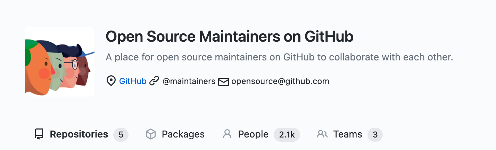
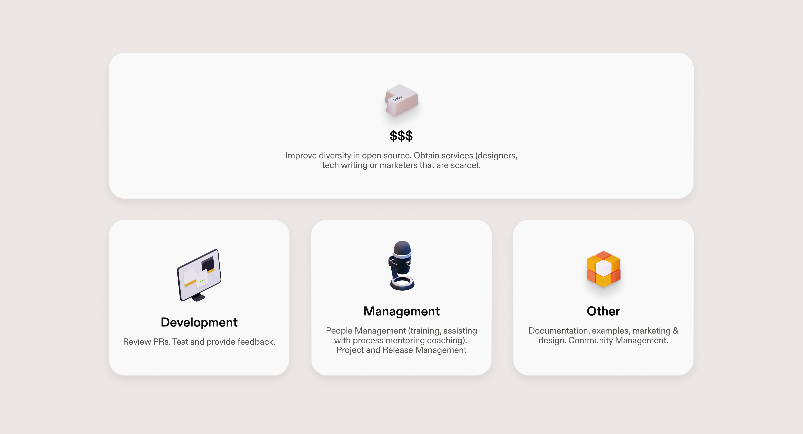
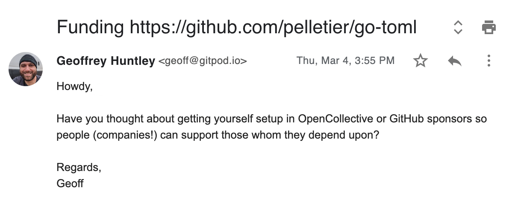
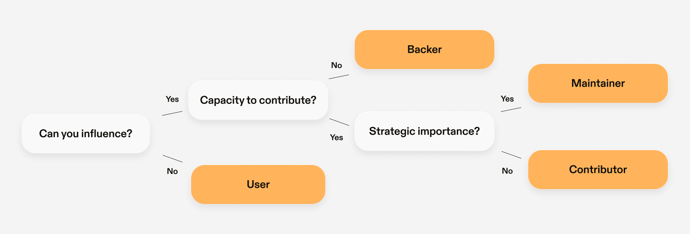

The myriad of tools relied upon by developers every day is built and maintained almost exclusively by unpaid volunteers. The maintainers of open-source projects - our digital infrastructure - are in desperate need of support. Because code is less charismatic than a hit YouTube video or Kickstarter campaign, there is little public awareness and appreciation for this work.

Open-source, by design, is not financially sustainable. Finding reliable, well-defined funding sources is exceptionally challenging. As projects grow in size, many maintainers burn-out, find themselves unable to satisfy increasing support/maintenance demands and, unfortunately, in my particular case, <a href="https://ghuntley.com/a-new-chapter">irrevocably harm their marriage</a>.

<a hre="https://twitter.com/freakboy3742">Russell Keith-Magee</a> delivered this beautiful keynote at PyCon, which captures the essence better than I can put in writing because it is such a personal topic.

`youtube: 0t85TyH-h04`

Much has changed since Russells' keynote and the infrastructure to financially support open-source maintainers now exists thanks to the efforts of Open Collective and GitHub Sponsors.

## Shape the future you want to live in

The truth is free software isn't free. How much is a task going to cost in person hours? Hours have rates. Rates require payment. Yet, an entire community of developers provide their services outside of their day job to produce tools consumed by businesses.

Did you know there are less than 2100 people in the inner GitHub open-source maintainer community?

**I often wonder what the future would look like if these high achievers that our digital society is built upon were empowered to become independent artists.** If just one of those people can help more people better understand a technology or improve the developer experience for an entire ecosystem what is the worth/value of that and why isn't our industry doing that yet?

The word volunteer, by definition, means those who have the ability and time to give freely.

Paying for resources that are being consumed broadens the list of people who can do open-source. Additionally, money enables open-source maintainers to buy services and outsource the activities that do not bring them joy.

At Gitpod, we firmly believe that working for an open-source project should be a legitimate alternative to a career working for a for-profit corporation. Additionally, we'd like everyone to be able to maintain open-source projects, not just people with the right financial background or youth that enables the ability to volunteer.

## Actions speak louder than words

Today we are announcing five things:

<h3 class="h4">Open Source Sustainability Fund</h3>

Gitpod has created an open-source sustainability fund and allocated an _initial_ amount of USD 30,000 towards securing our open-source supply chain by paying open-source maintainers.

<h3 class="h4">$1 for each new community member</h3>

For every registration to our newly created <a href="https://www.gitpod.io/chat">discord channel</a> during the next month we’ll donate an additional $1 to open-source projects we depend upon.

<h3 class="h4">DevX Conf</h3>

The upcoming (<a href="https://devxconf.org/">28th of April from 5pm CEST</a>) non-profit conference on developer experience - DevX Conf will donate all surplus and USD 500 for each Gold Sponsor to open-source projects. Additionally attendees of the conference will have a say how an additional USD 10,000 in open-source funding will be distributed between open-source projects that are unseen digital infrastructure.

<h3 class="h4">Build in the open</h3>

Over the coming months, Gitpod will share our experiences with funding open-source projects for other companies to follow and share insights for maintainers who wish to become financially independent.

<h3 class="h4">Democratize contributions</h3>

We recognise that money <a class="no-nowrap" href="https://www.youtube.com/watch?v=Mm_RuObpeGo">isn't the only way to resolve open-source sustainability</a>. Often the problem is access and the initial project setup friction. To address this Gitpod has made <a href="/docs/professional-open-source">Gitpod free for open-source communities</a> so that open-source maintainers can onboard new contributors to their project with standardized development environments. With Gitpod people from all over the world can contribute from any device without the typical $3,000 Macbook Pro barrier to entry.

## It's time to start giving back

Over the last couple months Gitpod has been emailing maintainers of dependencies that Gitpod consumes (<a href="https://github.com/gitpod-io/gitpod/blob/main/License.third-party.npm.txt">npm</a>/<a href="https://github.com/gitpod-io/gitpod/blob/main/License.third-party.go.txt">golang</a>/<a href="https://github.com/gitpod-io/workspace-images/blob/master/base/Dockerfile">Docker</a>) and asking them to get themselves signed up into the GitHub Sponsors or Open Collective programs.

If you appear in our bill of materials then Gitpod would like to unconditionally shout you some beers, some nice food or more as our way of saying thank-you for helping make Gitpod possible.

I hope more companies will follow Gitpod's lead and do this simple act en masse because maintainers must have income diversity because diversity creates a freedom that enables roadmap and project independence.

If you are a maintainer of an open-source project, then there's one simple, easy step you can do to enable Gitpod and other companies to provide financial support...

Go sign up to <a href="https://github.com/sponsors">GitHub Sponsors</a> or <a href="https://www.opencollective.com">Open Collective</a> as sending hand crafted emails asking you to signup isn't scalable and most companies would not do this manual grunt work. 😉

## Think ahead, secure your supply chain.

Nadia Eghbal, in 2016 with the support of the Ford Foundation, authored an <a href="https://www.fordfoundation.org/work/learning/research-reports/roads-and-bridges-the-unseen-labor-behind-our-digital-infrastructure/">extensive report</a> into the unseen labour behind our digital infrastructure. She recently published the successor of the report: <a class="no-nowrap" href="https://www.amazon.com.au/Working-Public-Making-Maintenance-Software/dp/0578675862">Working in Public: The Making and Maintenance of Open Source Software</a>. If you haven't read her work before, then start there.

_Credit: [XKCD](https://xkcd.com/2347/)_

Eghbal, in her work outlines, digital infrastructure should be treated as a necessary public good. Free public source code makes it exponentially cheaper and easier for companies to build software and makes technology more accessible across the globe. However, there is a common misconception that the labour for open source projects is well-funded. In reality, it is largely created and maintained by volunteers who do it to build their reputations, out of a sense of obligation or simply as a labour of love.

The thing about open-source software that's too often forgotten, it's AS-IS, no exceptions. There is absolutely no SLA. That detail is right there in the license!

**In business terms, open-source maintainers are unpaid and unsecured vendors.**

Gitpod hopes other companies will also start taking steps to mitigate this critical risk in their technology stack. In future blog posts, we will be sharing our experiences with funding open-source projects and insights for maintainers who wish to become financially independent.

## Towards a maintainer economy

Here is what you can do today:

<ol>
    <li>
      1- Generate the bill of materials in your commerical software.
    </li>
    <li>
      2- Identify whom your unpaid vendors are.
    </li>
    <li>
      3- Mitigate your supply chain risks.
    </li>
</ol>

In practice, this involves going through each one of your projects in your dependency tree and deciding on the appropriate strategy for that particular dependency.

Gitpod has plenty of smaller dependencies for doing activities such as parsing TOML. As that dependency isn't of strategic importance, the strategy to mitigate the risk would be to fund the project.

For dependencies that are of strategic importance, then the strategy would be a combination of financial support, becoming regular contributors to the project or even hiring the maintainers of these projects as engineers for [short|long]-term engagements.

Do you have more ideas on how funding can foster a diverse community? → Please <a href="/contact">get in contact</a>.

## See you at DevX Conference

That's it for now. I hope you'll join us for non-profit <a href="https://devxconf.org">DevX Conf</a>, a two-day virtual conference focusing on developer experience. Attendees of the conference will have a say how an additional USD 10,000 in open-source funding will be distributed between open-source projects that are unseen digital infrastructure.

<ol>
    <li>
      📆   From 5PM CEST on April 28-29.
    </li>
    <li>
      📍   <a href="https://devxconf.org">devxconf.org</a>.
    </li>
    <li>
      🎫  It's free & non-profit.
    </li>
</ol>
