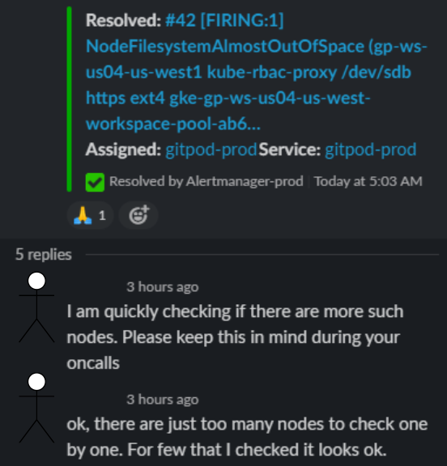
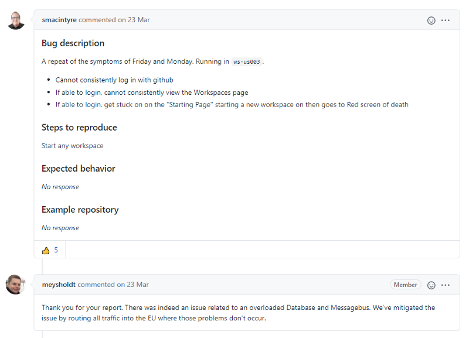

Gitpod is changing the way developers code. We're breaking the paradigm of relying on local environments to develop applications, by making those environments available through a web browser. Those environments are hosted in the cloud, they are ephemeral and they can be customized through automation to make them perfect for the project being developed.

Those cloud-based environments provide everything that our users have in their local machines, including [sudo access](/blog/root-docker-and-vscode#root-access) and [docker](/blog/root-docker-and-vscode#docker), and thanks to configuration-as-code (that can be automated) they remove the friction of installing and managing all different kinds of dependencies that we have when working on multiple projects. We want the world to forget about local environments and completely focus on our cloud-based environments.

_We gave those cloud-based environments a unique name: "Workspaces"._

Workspaces are the core of Gitpod, it is impossible to be a user of Gitpod without using Workspaces. To achieve the goal of making the world forget about local environments, _we need to be a service provider that developers can trust and rely on_, therefore, Workspaces need to be just as reliable as local environments!

Gitpod is scaling! [We are glad to be backed by fantastic investors](/blog/next-chapter-for-gitpod) and the topic "Cloud-based development" is on fire right now! Being the pioneers in this topic, it's only natural that we're getting more and more users every day. This is truly a great thing for us! We are honored to receive so much love in the last couple of months and we want to keep this momentum going, but this extra love also puts an extra load on top of our clusters and extra load sometimes leads to unreliability. It is awesome that people are starting to forget about their local environments thanks to Gitpod, therefore _we want Workspaces to maintain a fantastic performance, doesn't matter if we host ten, ten thousand, or ten million Workspaces concurrently._

## Reliability vs Velocity

Of course, Gitpod is a lot more than just an IDE with a terminal in the cloud. We have tons of features that make Gitpod shine amongst all other cloud-based development environments, such as [Prebuilds](/docs/prebuilds), [Sudo and Docker support](/blog/root-docker-and-vscode), [Shareable Workspaces](/docs/sharing-and-collaboration), while not mentioning our [Roadmap](https://www.notion.so/gitpod/Product-Roadmap-b9b5eac0a15147ac8d2dd25cf0519203) that is pretty ambitious too.

Developing and shipping new features is one of the things that make us more excited about our work, and hopefully our users too 😅, but making changes to production also comes with the risk of breaking stuff that was working just fine previously. Breaking small things is usually okay and we can keep focusing on new features, but we may break Gitpod so much that user experience decreases to a level that makes our users unhappy. That is a big no-no for us. If our users are unhappy then we need to do something about it, even if that means slowing down new features or completely stop them to fully focus on reliability depending on how bad the situation is. _But how do we decide if we should be focusing on reliability or feature velocity?_

Today we are not doing a great job when it comes to proactively identify degraded user experience. While we do have some metrics about Workspace startup latency and errors, most of our incidents were identified by noticing too many users complaining at our contact platforms, such as Github issues, email, and Twitter. Damn, we even got an incident that caused 100% unavailability because our SSL certificates expired back in February this year, and it took us almost half an hour to notice that 😅!

We do have things to be proud of though! Our Incident Response process, while it can be improved even further, has gotten a lot better since December 2020. We're coming up with post-mortems after almost all incidents and the team is tackling every action item raised. On these occasions, reliability usually has a higher priority than feature velocity. Some action items are taking a little longer to implement though, and these items are exactly the ones that will solve the problem mentioned before: _we need to get better at proactively identify degraded user experience._

## Alerting on symptoms instead of causes

Unfortunately, today we can't have clear insights if our changes have a direct impact on user experience. We come from a mindset of measuring compute resources, e.g. CPU, RAM, and disk utilization, as a way to know if Gitpod is running smoothly. This strategy worked just fine for some time, it was simple to horizontally or vertically increase our nodes, but now we are often seeing that lack of resources are not the reason why Workspaces start to fail. Not to mention that keeping a high number of nodes under a certain threshold is quite challenging.

We want to change this mindset completely! Compute resource metrics may be good for debugging degraded performance during incidents, but shouldn't be the way we look for degraded user experience. We should be gathering metrics that measure exactly the symptoms that our users complain about during incidents:

As previously said, Workspaces are the core of Gitpod. We should be measuring metrics that tell us how our users are interacting with them:

- How many workspaces are being created and how many fail during this process?
- How many of those Workspaces start in an acceptable time frame?
- After they start, do they remain working until the user chooses to stop them?

Gitpod has a lot more features than just hosting Workspaces but, as a first step, _getting metrics and alerts around Workspace behavior will cover most of the complaints we had so far._

## Service Level Objectives

These Workspace metrics will be key to our team when performing Site Reliability Engineering, but they alone aren't enough. They still don't answer the question: should we be focusing on reliability or feature velocity? We need to set clear expectations about when we consider Gitpod unstable or not.

_Service Level Indicators and Service Level Objectives will be our North Stars._ And they will be implemented with the metrics mentioned in the previous section of this blog.

SLIs are simple once we implement those metrics. It's a simple ratio calculation over some time period. E.g.:

- 

- 

- 

The SLOs, on the other hand, are a little bit more complicated. The SLO is a target of reliability that will better represent our users' "happiness", and measuring happiness is not really straightforward. We do know that aiming for 100% is not what we nor our users want though. Aiming for 100% means that 0 Workspaces can fail to start. Once we have a stable system, making changes to it, e.g. changing infrastructure to save costs or shipping a new exciting feature, is often the reason why said system becomes unstable even though those changes will often make us and our users more satisfied with our final product.

Now that we agreed that we won't aim for 100% availability, then what will be our target? Well, internally we do have an informal agreement that:

- 95% of Workspaces should start in less than 2 mins
- 50% of Workspaces should start in less than 15s
- 99.8% of Workspaces should start successfully
- 99.8% of Workspaces should remain working after they start

To be honest, however, in our first interaction it is a little bit unreal to write those targets in stone already. As we already mentioned in this blog post, we still don't have that measurement very well established, so we don't know what is the reality that we live in right now. It could be that to achieve those targets, we will need to stop feature development completely just to manually keep everything stable, and this is not what we want!

After implementing our metrics and SLIs, we can create dashboards and reports based on the SLOs' targets that we're aiming for in the future, but we will only establish real policies after we get some war experience and develop a good grasp of what we're dealing with 💪.
