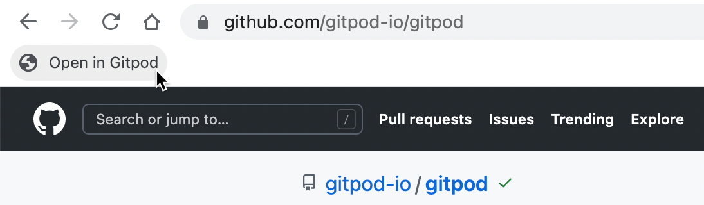
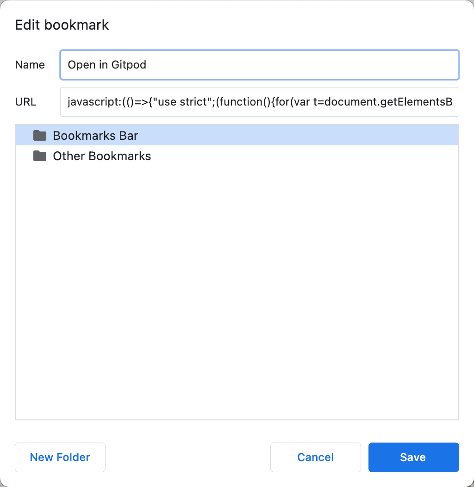

<script context="module">
  export const prerender = true;
</script>

# Browser Bookmarklet

Creating a workspace is as easy as prefixing any GitHub URL with `gitpod.io/#`.

For convenience, we developed a Gitpod browser bookmarklet as an alternative to [installing our browser extension](/docs/browser-extension) that does the
prefixing for you - as simple as that.

1. Drag the following image to your bookmark bar.



2. Select all of the code below and then copy it to your clipboard.

```javascript
javascript: (() => {
  "use strict";
  (function () {
    for (
      var t = document.getElementsByTagName("meta"), n = 0;
      n < t.length;
      n++
    ) {
      var o = t[n];
      if (o.content.toLowerCase().includes("gitlab")) return !0;
      if ("hostname" === o.name && o.content.includes("github")) return !0;
      if (
        "application-name" === o.name &&
        o.content.toLowerCase().includes("bitbucket")
      )
        return !0;
    }
    return !1;
  })() &&
    window.open(
      ("https://gitpod.io",
      "https://gitpod.io/#" +
        (window.location.protocol + "//" + window.location.host) +
        window.location.pathname)
    );
})();
```

3. Right-click edit the bookmark and replace the contents of the URL field with the code that is in your clipboard:



4. Done! Next time you are viewing a repository on GitHub, GitLab or Bitbucket press the bookmarklet to open the repository in Gitpod.

## Use with Gitpod Self-Hosted

If you are using Gitpod Self-Hosted you can still use the browser bookmarklet by configuring it with your self-hosted URL by replacing the `gitpod.io` URL with your self-hosted URL in the bookmarklet code.

```javascript
window.open(("https://gitpod.io","https://gitpod.io/#
```

## Source Code

Gitpod's browser bookmarklet is open source. You can check out its [source code](https://github.com/gitpod-io/browser-bookmarklet), or even open it in Gitpod:

[](https://gitpod.io/#https://github.com/gitpod-io/browser-bookmarklet)
