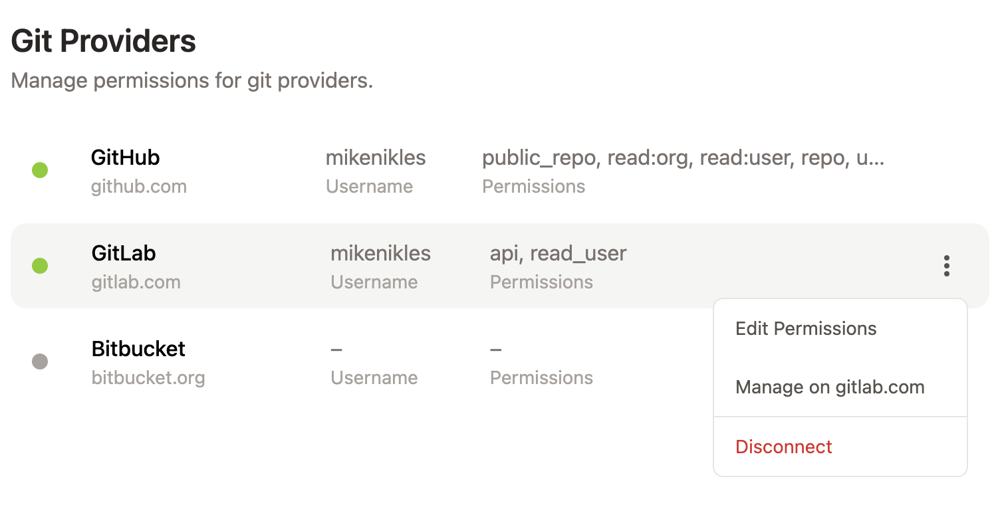
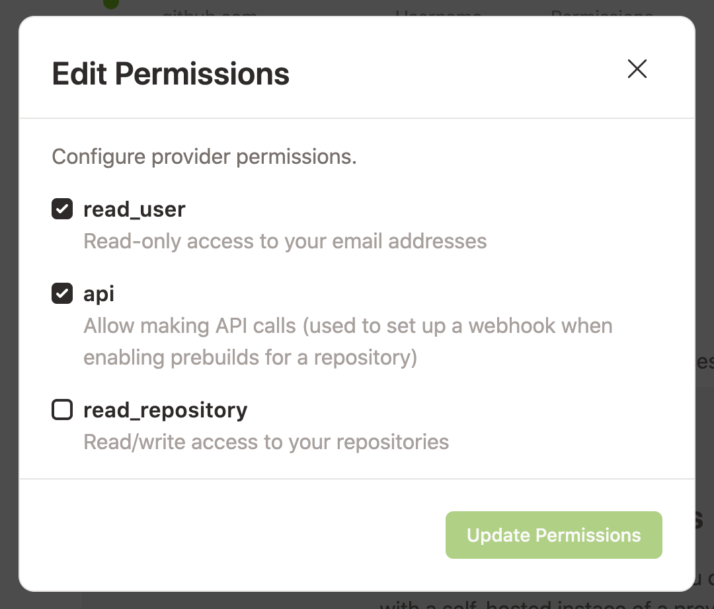
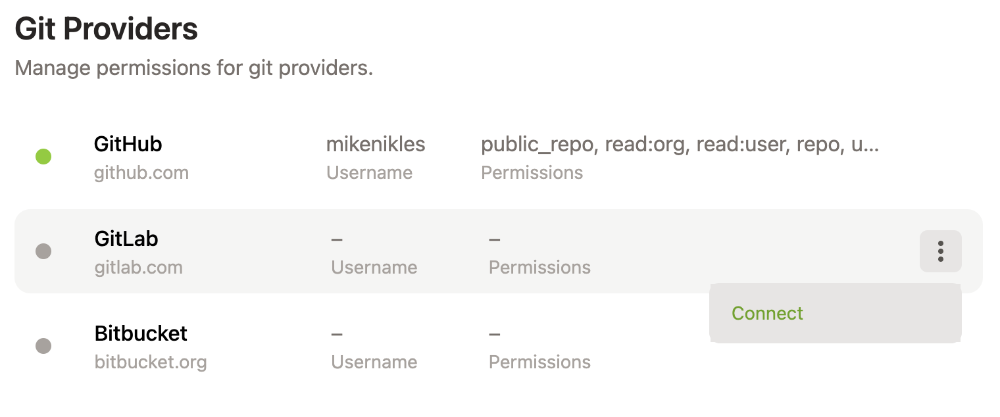
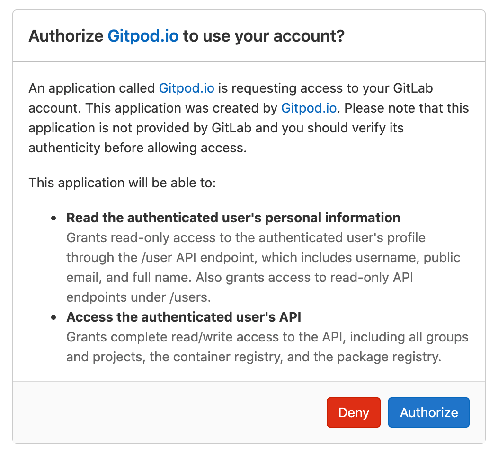
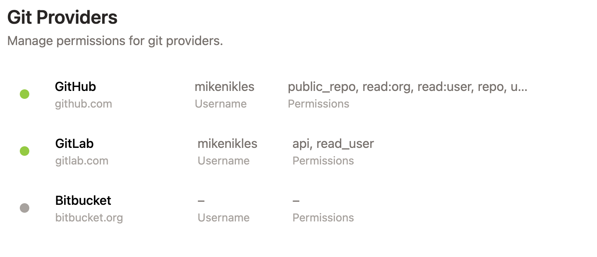
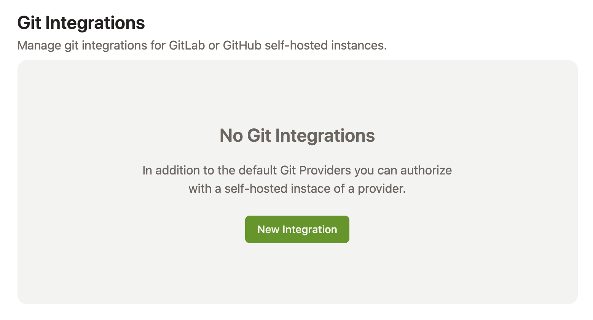
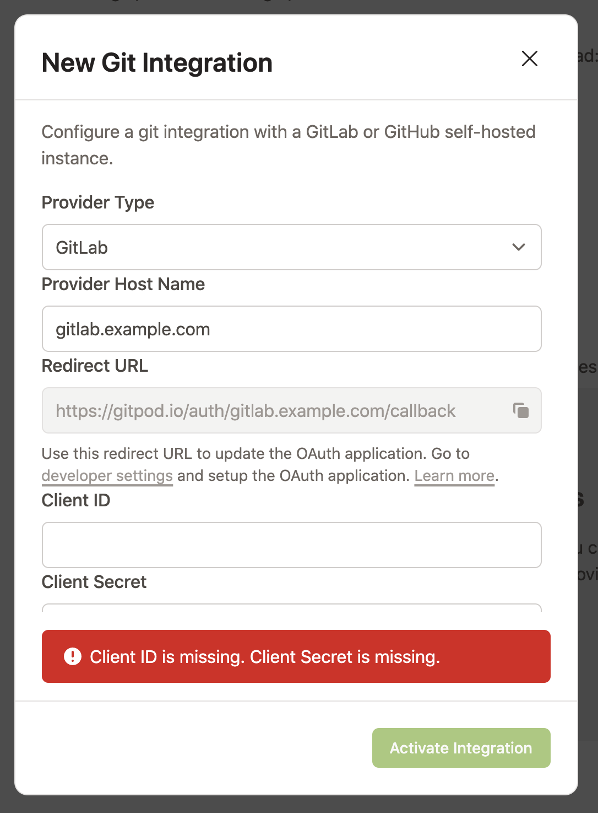

# GitLab Integration

Gitpod works nicely with GitLab: You can start Gitpod workspaces directly from the web pages of your GitLab repositories, and you can configure Gitpod to automatically prebuild these workspaces such that you can start coding on any branch in no time.

To use Gitpod on GitLab repositories, you have to link your GitLab account to Gitpod. Gitpod redirects you to GitLab's authentication workflow when needed. Alternatively, you might want to connect your [GitLab account manually](#connecting-your-gitlab-account).

All of this is already pre-configured for `GitLab.com` (the SaaS version), and can easily be set up for [self-hosted GitLab installations](#registering-a-self-hosted-gitlab-installation).

## Starting Workspaces

You can start a Gitpod workspace directly from the web pages of a GitLab repository. Simply click on the dropdown arrow next to the _Web IDE_ split button on the project or merge request page, and choose _Gitpod_. The Gitpod workspace will open in a new browser tab. The next time you visit a GitLab page, the last used action will be pre-selected.

To launch new Gitpod workspaces for issues, branches, specific commits, etc. you can also prefix any GitLab URL with `gitpod.io/#` as described in the [Getting Started](/docs/getting-started) page, or use the [browser extension](/docs/browser-extension) to add a convenient _Gitpod_ button to every GitLab page.

## Enabling Prebuilds

To automatically create a [prebuilt workspace](/docs/prebuilds) for each commit, Gitpod needs access to install a webhook. To allow this, go to Gitpod's [Integrations](https://gitpod.io/integrations/) page, scroll to the "Git Providers" section, click on the three dot button that pops up when you hover over the "GitLab" entry. Then choose _Edit Permissions_ from the popup menu.

In the "Edit Permissions" dialog, make sure that _api_ is checked such that Gitpod is allowed to install the webhook.

The webhook will be automatically installed when you trigger the first prebuild manually. For this, prefix your GitLab project URL with `gitpod.io/#prebuild/` as described in the [prebuilds page](/docs/prebuilds#on-gitlab-and-bitbucket).

## Connecting Your GitLab Account

To use Gitpod on a GitLab repository, you have to connect your GitLab account with your Gitpod account. In the follwoing, we assume that you already have a valid account on the GitLab instance you want to connect to.

Gitpod supports the following use cases:

- [Connecting Your GitLab.com Account](#connecting-your-gitlabcom-account)
- [Connecting Your Self-Hosted GitLab Account](#connecting-your-self-hosted-gitlab-account)

### Connecting Your GitLab.com Account

If you have initially logged into Gitpod using `GitLab`, your Gitpod account is already connected to your `GitLab.com` account and you can skip this section.

If you have logged into Gitpod with a different provider, you can manually add your GitLab account as follows:

1. Open [the integrations page](https://gitpod.io/integrations/). Scroll to the section about "Git Providers" and click on the three dot button that pops up when you hover over the _GitLab_ item. Select _Connect_ from the popup menu.

2. You will be redirected to GitLab's login page. Log in with your username and password or choose one of the OAuth providers from the list.

3. Once logged in successfully, you will be asked to authorize Gitpod to access your personal information on GitLab and use their API. Click _Authorize_.

4. You'll be directed back to Gitpod's settings page. A green bullet left to _GitLab_ signals you've successfully linked your GitLab account with Gitpod.

### Connecting Your Self-Hosted GitLab Account

A self-hosted GitLab installation has to be [registered to Gitpod](#registering-a-self-hosted-gitlab-installation) before it can be used. Once that's done, you can link your GitLab account on that installation to GitPod using the following steps:

1. Make sure you are logged into Gitpod.
2. In the same browser, open a new tab and navigate to a repository of the GitLab installation.
3. [Start a new Gitpod workspace](#starting-workspaces) on this repository.

### Disconnecting Your GitLab Account

To disconnect a GitLab account from your Gitpod account:

1. Open [the integrations page](https://gitpod.io/integrations/). Scroll to the section about "Git Providers" and click on the three dot button that pops up when you hover over the item of the GitLab provider you want to disconnect. Select _Disconnect_ from the popup menu.

This will only invalidate the current access token in Gitpod. To disable access for good you have to revoke the access to Gitpod on the GitLab side.

## Registering A Self-Hosted GitLab Installation

The SaaS service `GitLab.com` is already pre-configured in Gitpod. But if you are using a self-hosted GitLab installation, you have to register it in Gitpod before it can be used.

> Note that the registration has to be done by one Gitpod user only, and that the GitLab account of this user is automatically connected. All other users of the same GitLab installation should just [link to their GitLab accounts](#connecting-your-self-hosted-gitlab-account).

Here is how to register your self-hosted GitLab installation:

1. In your GitLab installation, enable the native Gitpod integration as described in the [GitLab docs](https://docs.gitlab.com/ce/integration/gitpod.html). This needs adminstrator privileges on the GitLab installation.

2. Head over to [the integrations page](https://gitpod.io/integrations/) on Gitpod. Scroll to the section about `Git Integrations` and click on the "New Integration" button.

3. In the pop-up window, choose GitLab as the provider type and enter the URL of the GitLab installation you want to use.

4. The next field in the form is the _redirect URL_ that you need to register Gitpod on the GitLab side. Copy the _redirect URL_ to your clipboard using the button on the right.

5. Go to `/profile/applications` on your GitLab installation to create an OAuth app. Type in a name (e.g. "Gitpod") and paste the _redirect URL_ in the corresponding text area. Check the scopes _api_ and _read_user_. Click the button _Save Application_ below.

6. Copy the _Application ID_ and the _Secret_ in the corresponding form fields (_Client ID_ resp. _Client Secret_) of your Gitpod installation.

7. Press _Connect_ and go through the GitHub authentication flow to connect your user account.
