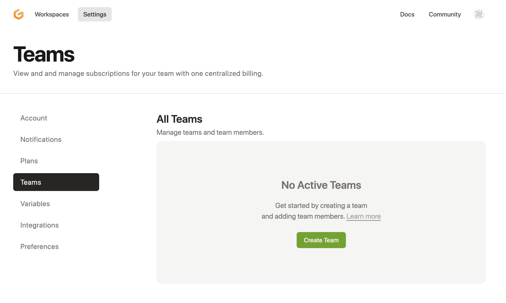
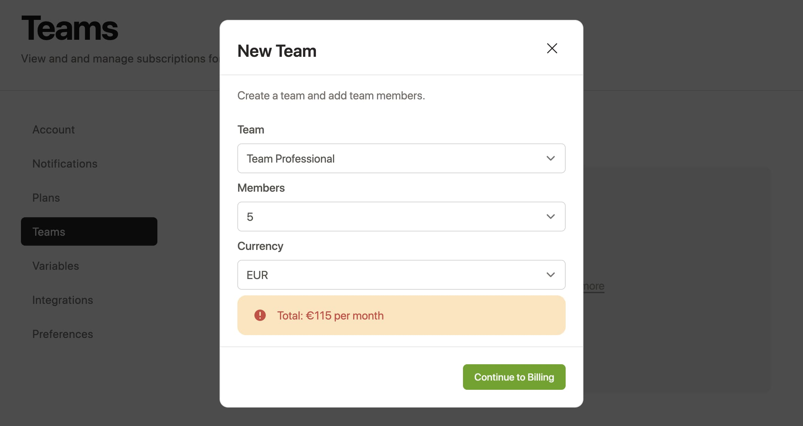
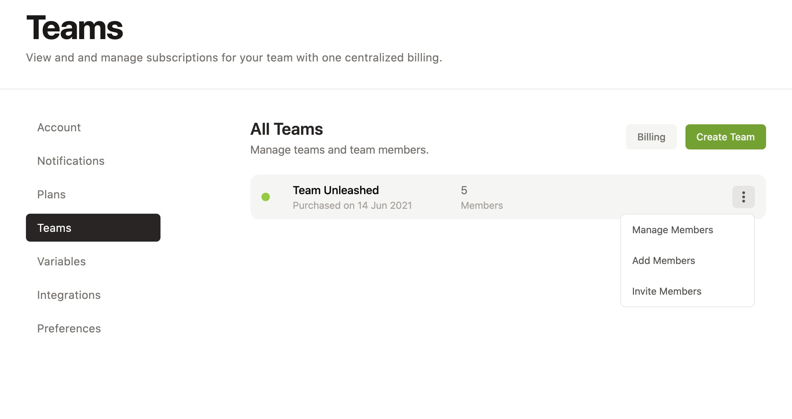
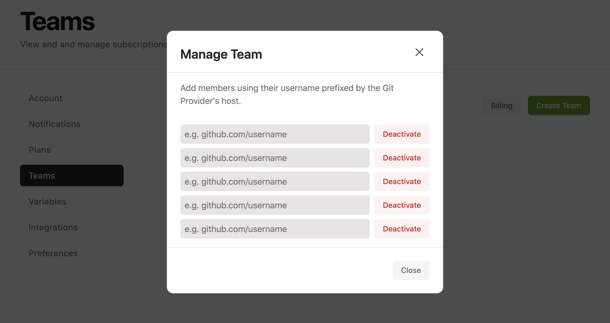

# Create a Team

From [gitpod.io/teams/](https://gitpod.io/teams/), you can create a team and manage subscriptions for your team members with centralized billing.

If you don’t have a Gitpod account yet, you’ll be asked to create one first. You can choose between the Team Professional or Team Unleashed plan and how many seats you want for each team.

Once the payment process is complete, you can manage team members, add more team seats, and also invite team members using a unique public URL.

| Payment in Progress                                        | Team Entry                                               |
| ---------------------------------------------------------- | -------------------------------------------------------- |
|  |  |

You can either directly assign a seat by entering your team member's GitHub username, or use the `Invite Members` link from the more actions button to get a shareable link. Send the link to your team so they can claim a seat.

| Manage a Team                                             | Invite Members                                            |
| --------------------------------------------------------- | --------------------------------------------------------- |
|  |  |

## Good to know

- You don’t need to have a subscription yourself in order to manage seats for your team. You can simply sign in to https://gitpod.io/teams/ for free.
- If you’d like to add more seats, delete seats or reassign existing seats, you can do these changes at any time.
